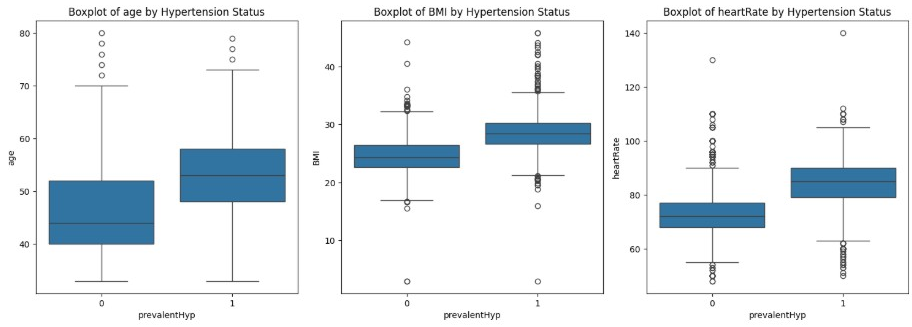
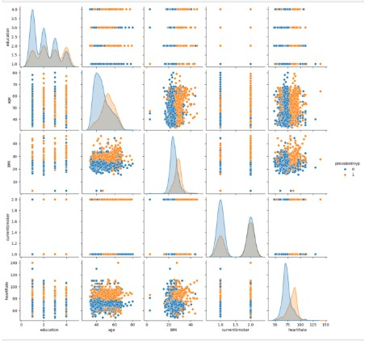

# EARLY-DETECTION-OF-CARDIOVASCULAR-DISEASES
## Problem Statement
Cardiovascular diseases (CVD) are a leading cause of morbidity and mortality worldwide. Early risk identification can enable timely lifestyle changes, diagnostic testing, and treatment—improving outcomes and reducing costs. Yet, clinicians are often faced with limited time and incomplete information at the point of care.

  

Two core questions drive this project:  
> 1. How risky is the patient right now?  
> 2. Given that risk, what action should we recommend next (e.g., further testing, closer follow-up, referral)?

In modern care settings, data science teams build predictive models that estimate CVD risk from routinely available data (demographics, vitals, symptoms, ECG/labs, comorbidities). When done well, these models help prioritize attention, standardize triage, and save clinical time—while always keeping clinicians in the loop.

## Goal of this Project

We operationalize real-time risk screening for three targets:
- Coronary Artery Disease (CAD)
- Hypertensive Disease
- Myocardial Infarction (Complications)

Patients’ basic details are captured (e.g., through an online form or EHR integration), features are preprocessed, and task-specific ML models generate a risk label (and optionally a probability). The system is designed to automate initial eligibility/risk checks so care teams can focus on the highest-risk patients and allocate diagnostic resources efficiently.

## Hypothesis Generation

Below are example factors hypothesized to affect CVD risk (dependent variables vary by task):
- Demographics: Age, sex.
- Anthropometrics: BMI, obesity flags.
- Lifestyle: Current/ex-smoker, pack-years, physical activity.
- Comorbidities: Diabetes mellitus, dyslipidemia, chronic kidney disease, CHF, thyroid disease, family history of CVD.
- Vitals: Systolic/diastolic BP, heart rate.
- Symptoms & Exam: Typical chest pain, dyspnea, murmurs, peripheral pulses, edema, lung rales.
- ECG markers: Q-waves, ST elevation/depression, T-wave inversion, LVH, poor R progression.
- Echocardiography: Ejection fraction (EF), regional wall motion abnormalities, valvular disease.
- Laboratory values: Fasting blood sugar, creatinine, TG, LDL, HDL, BUN, hemoglobin, electrolytes, WBC differential, platelets.
  
Intuition (non-exhaustive): higher age/BMI/BP, smoking, diabetes, abnormal ECG findings, and adverse lipid profiles may increase CAD/MI risk; sustained high BP and elevated heart rate may associate with hypertension; reduced EF and abnormal clinical/lab markers may signal MI complications.

## Data Source

This project uses task-specific CSV datasets (typical filenames):
> - Coronary Artery Disease.csv (CAD classification)  
> - Hypertension_data.csv (Hypertensive Disease classification)   
> - Myocardial infarction complications Database.csv (post-MI complications classification) 

Each train file contains features plus a binary target; each test file contains features only. Model training is performed on the train split; predictions are generated for test data. Feature sets range from a handful (e.g., hypertension) to a large schema (e.g., MI complications) including clinical flags, vitals, ECG/labs, and imaging summaries.

Replace/augment these with your institution’s data as permitted. Ensure appropriate governance for any protected health information.

## Exploratory Data Analysis (EDA)
### 1) Univariate Analysis

We inspect each variable independently:
- **Categorical features:** frequency tables/bar charts for sex, smoking status, diabetes, typical chest pain, ECG flags, etc.
- **Continuous features:** distributions and boxplots for age, BMI, BP, heart rate, EF, lipid panels, glucose, creatinine.  
Typical (illustrative) observations: more older patients in higher-risk groups; skewness in lab values (e.g., triglycerides); EF often shows a long tail towards lower values among patients with complications.

  

### 2) Bivariate Analysis

We analyze each predictor vs. the target:
- **CAD:** higher probability with typical chest pain, ST-depression/T-inversion, dyslipidemia, diabetes, reduced exercise tolerance.
- **Hypertension:** rising prevalence with age/BMI; higher resting heart rate may associate with sustained hypertension.
- **MI complications:** lower EF, hemodynamic instability, and certain lab abnormalities associate with adverse outcomes.

Bar plots and conditional distributions help surface such patterns.

  

### 3) Correlation Plot

A heatmap of numerical features reveals multicollinearity:
- SBP↔DBP and their derivatives (mean arterial pressure, pulse pressure)
- Lipid inter-relations (e.g., LDL with total cholesterol, TG)
- Hematologic markers (e.g., WBC with neutrophils/lymphocytes)
- EF often negatively correlates with failure/complication flags

Understanding these relationships guides feature engineering and model choice (e.g., tree models vs. linear models with regularization).

  

## Model Building

We use Stratified cross-validation (e.g., StratifiedShuffleSplit/StratifiedKFold) and compare multiple algorithms:

- Logistic Regression (with L1/L2 or Elastic Net)
- Support Vector Machines
- Random Forest / Gradient Boosting / XGBoost
- Calibrated models (Platt or isotonic) for well-calibrated probabilities

Hyperparameters are tuned via grid/random search. Class imbalance is handled with class weights or SMOTE (evaluated carefully to avoid leakage).

## Model Comparison

Across tasks, different families may dominate:

> - CAD: tree-based ensembles often capture nonlinear interactions among ECG/lab flags.
> - Hypertension: linear/SVM baselines can perform strongly with a compact feature set.
> - MI complications: gradient boosting frequently excels on wide, mixed-type clinical schemas.

Final selections are based on cross-validated discrimination (AUROC), calibration, and recall at clinically acceptable false-positive rates. Document the chosen model per task and version each artifact (model + scaler).

## Actions Taken

- Explored and profiled datasets to understand distributions and missingness.
- Ran statistical tests/visual analyses to surface relationships useful for prediction.
- Engineered domain features (pressure metrics, lipid ratios, ECG/echo summaries).
- Built baselines, compared advanced algorithms, tuned hyperparameters.
- Assessed discrimination, calibration, and class-imbalance impacts.
- Produced production-ready artifacts and input validation schemas.

## Future Improvements

- More data & external validation: broaden populations and care settings; evaluate generalization.
- Imbalance strategies: threshold tuning by use-case, cost-sensitive learning, focal losses.
- Ensembles & stacking: blend calibrated models to improve robustness.
- Temporal modeling: incorporate longitudinal vitals/labs; survival/time-to-event analysis.
- Fairness & bias audits: measure subgroup performance; mitigate disparities.
- Explainability: SHAP-based insights for clinician trust and QA.
- MLOps: data/feature drift monitoring, automated re-training with governance.
- Integration: EHR/API hooks for real-time risk scoring and clinician workflow prompts.

## Disclaimer

This project is for research and educational use only. It is not a medical device and must not be used for diagnosis or treatment without appropriate regulatory clearance and clinical oversight. Always involve qualified clinicians in interpretation and decision-making.

